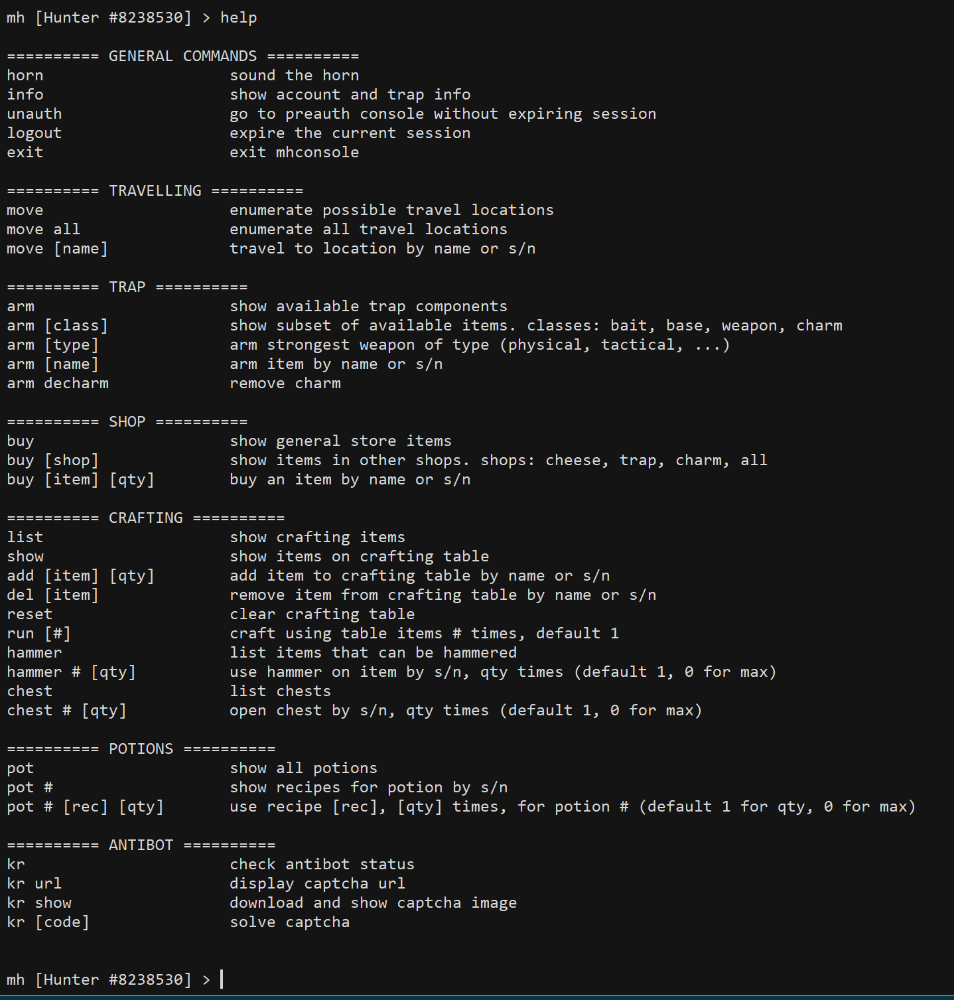

# mousehunt scripts

A couple of python scripts to help with [Mousehunt](https://www.mousehuntgame.com/). 
* [autohunt.py](#autohunt)--A script to automate some aspects of MH.
* [mhconsole.py](#mhconsole)--A console-like interface for interacting with the game.
* [shuffle.py](#shuffle)--A small script to automate solving Spooky Shuffle in MH's Halloween 2022 event.

To run these scripts, you'll need python with the [requests library](https://pypi.org/project/requests/).

*The use of any of these scripts is against [Mousehunt's rules](https://hitgrab.helpshift.com/hc/en/3-mousehunt/faq/44-scripts-auto-clickers-and-software).* The usual disclaimers follow.

<a name="autohunt"/>

## autohunt.py
This script automates some aspects of MH. It's key functions are
* automatically sounding the horn regularly
* detecting and bypassing antibot
* changing the trap setup according to the requirements of some quests.

### Basic usage
Change the first few lines of the script to include some form of valid credentials (either username + password or an active session cookie), then run the script without arguments. If the credentials provided are valid, the script will start and sound the horn at 15-20 mins intervals continually until you abort it.

On successful login, the session cookie is printed to the console. For stealth, it's advisable to save the cookie value in the script so that the script logs in using the cookie next time instead of a password--the former is more similar to non-bot behaviour.

### Parameters
Three parameters govern the rate at which the horn is sounded.
* Interval: The minimum waiting time in mins between horns
* Randomness: The length in seconds of the interval from which the waiting time will be randomly chosen
* Miss probability: The probability of missing a horn

These parameters have default values of 15 mins, 300 secs, and .15 respectively (wait between 15-20 mins between horns, miss 15% of the time). These can be overwritten with the -i, -r, and -m options, respectively. 

There are also preloaded sets of non-default values for convenience. Running autohunt with the -A option puts it in aggressive mode, in which the horn sounds roughly every 15 mins without missing. Running autohunt with the -P option puts it in paranoid mode, in which autohunt waits between half to one hour between horns and misses 20% of the time.

### King's reward
Autohunt has three possible antibot modes: standard, silent, and bypass. Standard mode is default.

In standard mode, when KR appears, autohunt reports 'antibot triggered', downloads the KR image to your device, opens it automatically, then waits for input. From here, you have three options. If you just press enter at the prompt, autohunt opens the image again. If you enter 'url', the image url is printed. If you enter anything else, that's interpreted as an attempt to solve KR. If the code is correct, autohunt resumes.

You can run autohunt in silent mode with -S, in which the KR image isn't opened automatically. Or, you can run autohunt in bypass mode with -b, in which autohunt simply reports whether KR is active, but runs as usual even if it is. If you notice that KR is active, you can resolve it via [mhconsole](#mhconsole).

### Cycles
Running autohunt with one of the preset cycles will automate some game actions that might be taken between horns, usually according to the requirements of a quest. Choose the cycle with -C; and if there are options for that cycle, set them with -z. To see the options for each, run autohunt with 'list' as the -C value--autohunt will print the options and quit.

### Other features
**User-agent.** For stealth, autohunt tries to replicate the http headers that would have been sent with requests made from a browser. The User-Agent header is customisable, and you should choose the one corresponding to the browser on which you normally play MH. If you run autohunt with the -ua option set to these pre-defined values, the User-Agent header will be set accordingly:
* 'firefox': firefox on windows (this is the default value)
* 'chrome': chrome on windows
* 'edge': edge on windows
* 'mac': safari on mac
* 'iphone': safari on iphone

If you set anything else as the value of ua, the User-Agent header is set to that.

**First wait.** When autohunt starts, the horn is first sounded 2s after it's available and without missing. To delay the first horn, set the value of the -w option to the time in minutes (from the time the script is started) that autohunt should wait.

 

<a name="mhconsole"/>

## mhconsole.py
This is intended to be a companion script to autohunt. It creates a CLI for interacting with the game, so you can do things like solve KR or move between horns while autohunt is running, without going to the trouble of accessing the game in-browser.

### Logging in
As with autohunt, you can login either using your MH username + password or an active session cookie. You can either modify the first few lines of the script to input your credentials, or submit them after mhconsole has started. If you choose the latter, mhconsole will start with an unauthenticated session. From here, enter 'help' to see your options

Enter 'user [username]' to give the script your username, and likewise for your password or cookie. Enter 'show' to check the credentials you submitted, and 'login' to attempt to login with those credentials. You'll need either a valid username+password combination or a valid cookie to login. If your login is successful, the script will say so and the prompt will show your username:

If you input your credentials directly to the script, you'll see the authenticated prompt immediately on starting mhconsole.

### Functions
From an authenticated session, enter 'help' to see your options

I think most of these are quite intuitive. For instance, 'info' shows you stuff about your current setup:

'hammer' shows you the things on which you can use the Hunter's Hammer. To use the Hammer, enter 'hammer' followed by the serial number of the thing you want to hammer, followed optionally by the quantity you want to hammer. If you don't provide a quantity, it defaults to 1. If you enter 0 for the quantity, it hammers all of that item you have.

Most of the other functions work similarly to the above two examples.

### Antibot
Both the 'info' and 'kr' commands involve checking for antibot. If antibot is found to be active, a (!) appears at the prompt until it's resolved. Mhconsole is not affected by antibot, in that all its functions are retained even while antibot is active. 

 

<a name="shuffle"/>

## shuffle.py
In Oct 2022 MH had a Halloween event with a card-matching game. This script automates solving the game using what I think is an optimal algorithm--theoretically, it takes between 1-8 tickets to solve; practically, it usually takes between 4-6 tickets. 

It takes one required argument and two optional arguments:  
(1) A cookie value or the alias of a cookie value saved in the cache dict--required. 
(2) An integer from 0-3 indicating the level of the game to play--optional if you've an ongoing game, required if you don't. 
(3) Put any string as the third argument to start an upgraded version of the shuffle board, if you've the spooky dust (can't remember what it's called) to do it.
  

If you've an ongoing game, the script will resume that. Otherwise, it will start a new game using the parameters you gave it.
